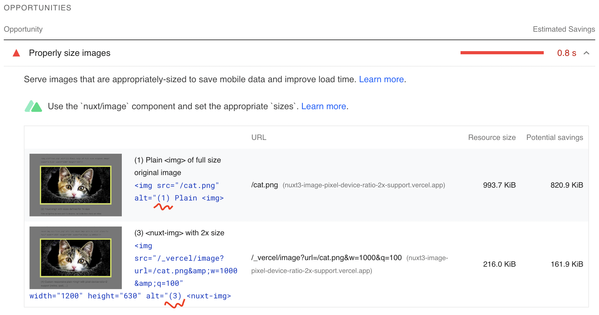

# nuxt3-image-pixel-device-ratio-2x-support

**Feature request:** Support responsive image sizes/srcset for `pixel-device-ratio` > 1 for properly sized images to be displayed on HD and Retina screens, iPad, ...

Reproduction example for [https://github.com/nuxt/image/issues/618](https://github.com/nuxt/image/issues/618)

## Context

> On ‘normal’ screens, using the viewport width seems sufficient to choose the correct size of the image. But with HD and Retina screens you want to serve bigger sizes of the image. Et voilá, here comes srcset and sizes! With srcset and sizes the browser also takes into account the pixel density of the screen.
> 
> To calculate the pixel density of a screen, browsers make use of the pixel-device-ratio. A pixel-device-ratio of 1 means that one device pixel corresponds to one CSS pixel. A pixel-device-ratio of 2 means that two device pixels corresponds to one CSS pixel.
> 
> For example, an iPad Air 2 has a screen resolution of 2048 by 1536 pixels (source: Wikipedia). The pixel-device-ratio of this iPad is 2. Which means that for the browser, the screen is 1024 by 768 pixels.

Source: [https://medium.com/@woutervanderzee/responsive-images-with-srcset-and-sizes-fc434845e948](https://medium.com/@woutervanderzee/responsive-images-with-srcset-and-sizes-fc434845e948)

## Demo

Hosted on vercel: [https://nuxt3-image-pixel-device-ratio-2x-support.vercel.app/](https://nuxt3-image-pixel-device-ratio-2x-support.vercel.app/)

### PageSpeed Insights

Lighthouse Scan: [https://pagespeed.web.dev/report?url=https%3A%2F%2Fnuxt3-image-pixel-device-ratio-2x-support.vercel.app%2F&form_factor=desktop](https://pagespeed.web.dev/report?url=https%3A%2F%2Fnuxt3-image-pixel-device-ratio-2x-support.vercel.app%2F&form_factor=desktop)



### Screenshot from Retina Screen - Option (2) vs. (3)

-vs-(3).png)

## Conclusion

I'd like nuxt/image to somehow allow `srcset` to be created which includes pixel-device-ratio 2x (maybe others, too?) such as the manually coded **option (4)** which includes _srcset_ options for **[250w, 500w, 1000w]**.

This is the only solution which provides both
1. efficiency -> appropriately-sized to save mobile data and improve load time
2. quality -> bigger (sharp) images on HD/Retina/iPad with high screen pixel density

on all devices.

### Rendered as

```html

```

## Setup

Make sure to install the dependencies:

```bash
yarn install
```

## Development Server

Start the development server on http://localhost:3000

```bash
yarn dev
```

## Production

Build the application for production:

```bash
yarn build
```

Locally preview production build:

```bash
yarn preview
```

## Vercel deploy

```bash
vercel
```
